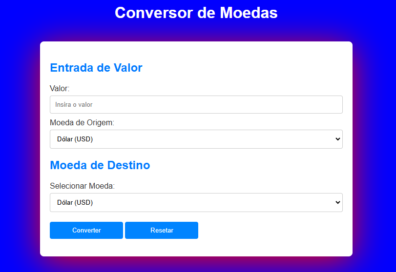

<h1 align = "center"

Conversor de moedas 

># License
>  

## Descrição do Projeto
Este projeto foi desenvolvido na aula de PWI (Programação Web 1), ministrada pelo professor [Leonardo Rocha](https://github.com/leonardossrocha). O objetivo do projeto é aprender a converter valores de moedas, ainda de forma simples, porém logo esse projeto terá uma continuação mais aprimorada.

## Funcionalidades do website

✔️ Verificação de Campos Obrigatórios;

✔️ Resetar o formulário;

✔️ Preencher Formulário;

✔️ Converter moeda;

✔️ Inserir valor;

✔️ Resultado do valor inserido;

## Tecnlogias utilizadas 🔧

